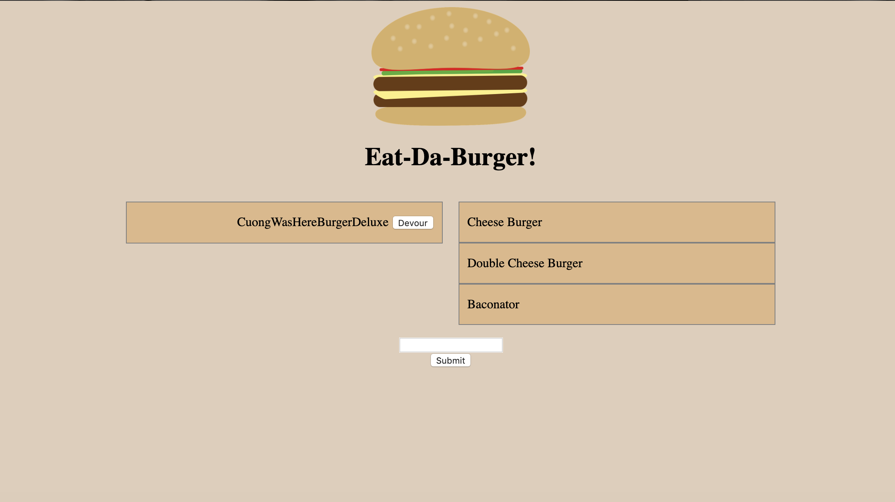

# Eat-Da-Burger

This app allows you to add a burger to the menu and devour the burgers added!

### [Give it a try!](https://eat-da-burgers-menu.herokuapp.com/)

or you can watch a demo video [here](https://drive.google.com/file/d/1YH1t3Rz9lkIrINulmmpzKJXd0bRohawU/view)!

### Get Started

On this app you'll want to click on the input field and type in a burger name. After, your burger will populate on the screen. You can add as many burgers as you would like! Whenever you're ready to eat one of the burgers, click devour and it will populate into your devoured category.

### Built With

* Handlebars
* MYSQL
* Node
* Express
* Javascript
* ES6
